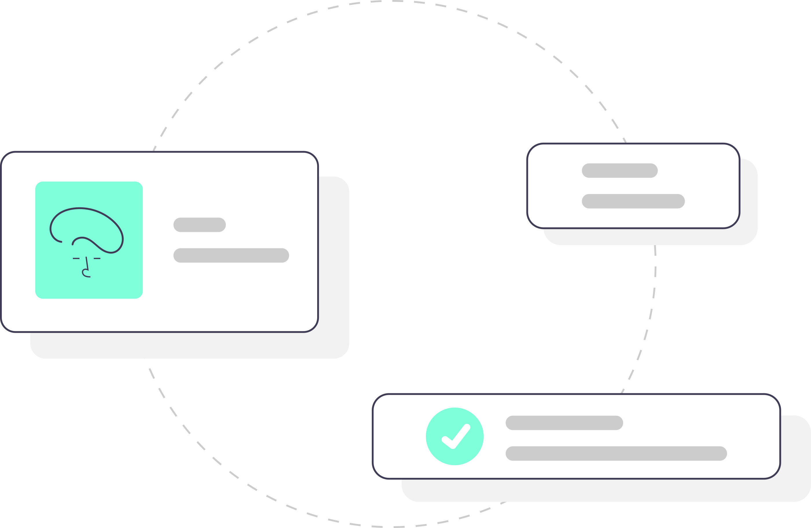

# Boilerplate de next.js

  

# :page_with_curl: Índice

* [Sobre o projeto](#interrobang-sobre-o-projeto)
  - [Tecnologias utilizadas](#-tecnologias-utilizadas)
* [Executando a aplicação](#rocket-executando-a-aplicação)
* [Para contribuir](#mailbox-para-contribuir)
* [Histórico de atualizações](#clock10-histórico-de-atualizações)

# :interrobang: Sobre o projeto

Criação de um boilerplate para facilitar a criação e configuração de um novo projeto Next com as ferramentas mais utilizadas.

## 🧑‍💻 Tecnologias utilizadas

- [Next](https://nextjs.org/)
- [React](https://reactjs.org)
- [TypeScript](https://www.typescriptlang.org/)
- [Storybook](https://storybook.js.org/)
- [Jest](https://jestjs.io/pt-BR/)
- [Styled-components](https://styled-components.com/)
- [Babel](https://babeljs.io/)
- [ESLint](https://eslint.org/)
- [Prettier](https://prettier.io/)
- [Semantic-release](https://semantic-release.gitbook.io/semantic-release/)
- [Lint-staged](https://github.com/okonet/lint-staged)
- [Commitizen](hhttp://commitizen.github.io/cz-cli/)
- [Commitlint](https://commitlint.js.org/#/)
- [Husk](https://typicode.github.io/husky/#/)
- [Next PWA](https://github.com/shadowwalker/next-pwa#readme)
- [Plop JS](https://plopjs.com/)

# :rocket: Executando a aplicação

Primeiramente clone o repositório para sua maquina ou faça o 'download' em formato ZIP e descompacte. Para realizar a clonagem do repositório utilize o comando:

    git clone git@github.com:PedroHenry-Santos/boilerplate-next-styled-typescript.git

Após basta instalar as dependência utilizando o gerenciador de pacote de sua preferência. Conforme abaixo:

    yarn install

E utilizar o comando:

    yarn dev

Agora você pode acessar [`localhost:3000`](http://localhost:3000) do seu navegador.

# :mailbox: Para contribuir

Caso queira ajudar a implementar novas funcionalidade nessa aplicação, poderá seguir o **roteiro de funcionalidades** a seguir. Ou também poderá propor sua própria funcionalidade.

Para isso basta seguir o [roteiro](https://github.com/PedroHenry-Santos/boilerplate-next/blob/main/CONTRIBUTING.md) em CONTRIBUTING.
## :clock10: Histórico de atualizações

Para saber sobre as [versões](https://github.com/PedroHenry-Santos/boilerplate-next/releases) deste código consulte o CHANGELOG detalhado.

# :lock: Licença

[MIT License](https://github.com/PedroHenry-Santos/boilerplate-next/blob/main/LICENCE.md) ® [Pedro Santos](https://github.com/PedroHenry-Santos)
